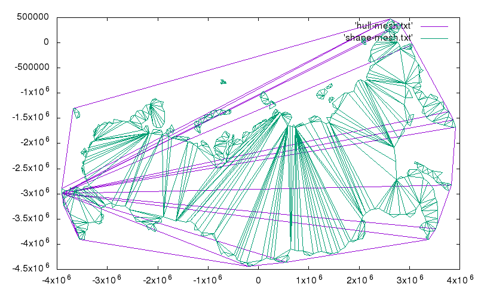
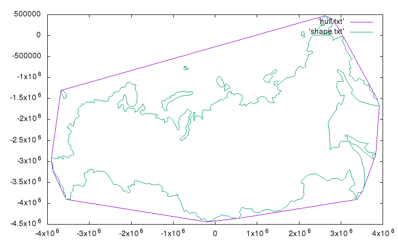
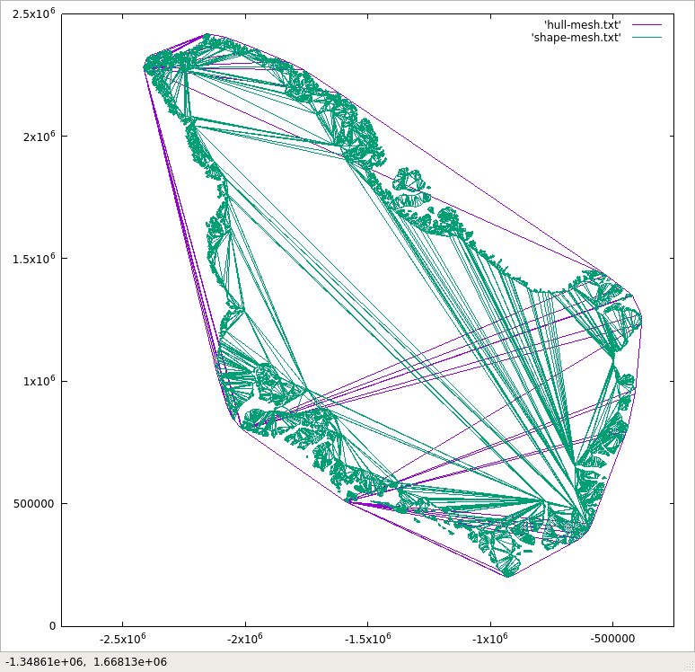
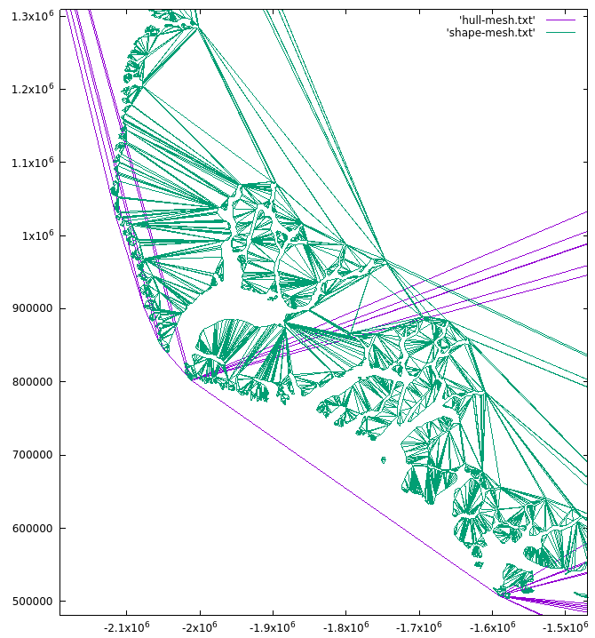
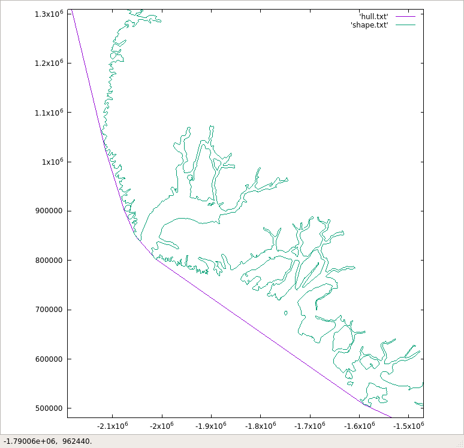

Tetra Tree Triangle Mesh
========================

Some experiments with geo data

DONE
----

* Loading and parsing ESRI Shape files throgh shapelib
* Reprojecting data through projlib
* Teselating shapes through ear clip algorithm
* Convex hull for shapes through Chan's algorithm
* Eport results to bare txt format and triangle's poly

TODO
----

* Tetra tree
* Square tree
* Hexa tree
* Data integration
* Holes in shapes

Primitives
==========

* point_t
* shape_t
* mesh_t

Resources
=========

* http://doc.cgal.org/latest/Manual/packages.html

Teselation
----------

* http://www.cs.man.ac.uk/~toby/alan/software/
* http://vterrain.org/Implementation/Libs/triangulate.html
* http://sites-final.uclouvain.be/mema/Poly2Tri/
* http://people.eecs.berkeley.edu/~jrs/mesh/
* http://www.realtimerendering.com/resources/GraphicsGems/
* http://algolist.manual.ru/maths/geom/polygon/decompose_seidel.php

ConvexHull
----------

* http://www.qhull.org/html/

Examples
========

